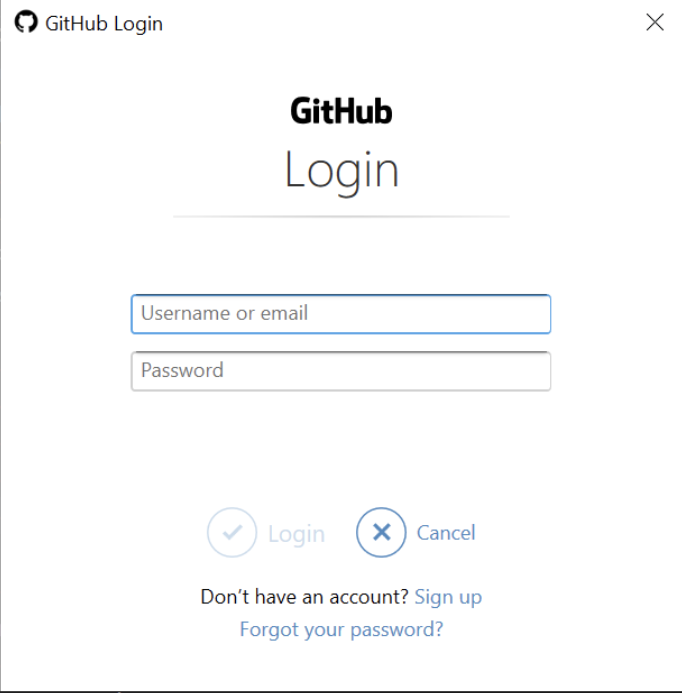

# git-newbie-playground
This is a repository for Git newbies to fork and play with. 


# Setup Git and GitHub
⚠️ Setting up Git on your local machine / laptop can be a bit of a pain and might not work the first time. I tried to describe a way that _should_ work. That being said, I could not test it extensively (because Git is already set up for me and I don't have access to a Windows machine). Please don't give up - once you have set it up correctly you don't need to do this again. ⚠️

**If something does not work for you, please open an issue [here](https://github.com/CorrelAid/git-newbie-playground/issues). That would really help me in improving this material!**

## 1. Create GitHub account
- Create a GitHub account if you have not already: https://github.com/join
- Create a **private** repository called `git-tryout`: https://github.com/new . Make sure to tick the "Add a README file" box.

## 2. Install Git

### 2.1. Windows
- install Git: https://git-scm.com/download/win
- If you have Git installed already, please make sure that you have at **least version 2.29** (required for storing credentials securely): 
```
git version 
```
If you do not have at least version `2.29`, please update Git: 

```
git update-git-for-windows
```

### 2.2. Mac
- install Git, see [here](https://git-scm.com/book/en/v2/Getting-Started-Installing-Git)

### 2.3. Linux
- Git should already be installed on your machine. To check, please run: 
```
git version
```
If not, please google "install git {your distro}" and you should find out how to install it.

## 3. Introduce yourself to Git

Open a terminal (Mac / Linux) or Git Bash (Windows).

Copy each of the following commands, adapt the name and email address (the email address should be the address you used for your GitHub account), and hit enter.

```
git config --global user.name 'Jane Doe'
git config --global user.email 'jane@example.com'
git config --global alias.graph 'log --graph --oneline'
git config --global --list
```

## 4. Authentication

### 4.1. Create a Personal Access Token
- https://github.com/settings/tokens
- give it a name like "personal laptop" 
- **make sure to give it the "repo" scope**
- copy the token somewhere temporary - but don't save it!

This is also described in [this guide](https://docs.github.com/en/github/authenticating-to-github/creating-a-personal-access-token) 

Now, we have to store the Personal Access Token (PAT) on our Laptop and tell Git to use it when communicating with GitHub. In order to do so, we need a Git "credential helper".

### 4.2. Store the Personal Access Token safely

### 4.2.1. Windows

Open Git Bash, copy+paste the following command and hit enter: 

```
git credential-manager-core configure
```

this tells git to use the [credential-manager-core](https://github.com/microsoft/Git-Credential-Manager-Core) as the _credential store_.


just to make sure, we also update the git config (this might be necessary if you had git installed before):

```
git config --global credential.helper manager-core
```

If you get the following error/warning:

```
warning: credential.helper has multiple values
error: cannot overwrite multiple values with a single value
       Use a regexp, --add or --replace-all to change credential.helper.
```

this means that you already have a credential helper configured. You can check the values like so:

```
git config --global --list
```

if you are sure that you don't need the other credential helpers, you can override all with `credential-manager-core`:

```
git config --global --replace-all credential.helper manager-core
```

we need to _trigger_ the credential store to save our Personal Access Token in it, so let's clone ("download") your private repository `git-tryout` that you created before:

```
git clone https://github.com/{your_github_username}/git-tryout
```

A popup should pop up asking you to authenticate via GitHub. Now, enter your username and **the Personal Access Token** instead of your GitHub password and confirm!

 

Git should clone your repository. You can confirm it is there by running `ls` in your Git bash window

```
ls
```

`git-tryout` should be in the list.

### 4.2.2. Mac
Install **[Git Credential Manager Core](https://github.com/microsoft/Git-Credential-Manager-Core/releases/tag/v2.0.394-beta)** by downloading and executing the `pkg` installer. 

Open a Terminal, copy+paste the following command and hit enter: 

```
git credential-manager-core configure
```

this configures the credential manager and tells git to use the [credential-manager-core](https://github.com/microsoft/Git-Credential-Manager-Core) as the _credential store_.

just to make sure, we also update the git config (this might be necessary if you had git installed before):


```
git config --global credential.helper manager-core
```

If you get the following error/warning:

```
warning: credential.helper has multiple values
error: cannot overwrite multiple values with a single value
       Use a regexp, --add or --replace-all to change credential.helper.
```

this means that you already have a credential helper configured. You can check the values like so:

```
git config --global --list
```

if you are sure that you don't need the other credential helpers, you can override all with `credential-manager-core`:

```
git config --global --replace-all credential.helper manager-core
```

we need to _trigger_ the credential store to save our Personal Access Token in it, so let's clone ("download") your private repository `git-tryout` that you created before:

```
git clone https://github.com/{your_github_username}/git-tryout
```

A "dialogue" will appear in the terminal. Make sure to select option 2 by typing in "2" and hitting enter. Then paste your PAT:


Hit enter. 

Git should clone your repository. You can confirm it is there by running `ls` in the terminal. The list should include `git-tryout`.


### 4.2.2. Linux 

You should use the `libsecret` package, see [this article](https://www.softwaredeveloper.blog/git-credential-storage-libsecret)

If this is not an option on your Linux distro, you can: 
- install [Git Credential Manager Core](https://github.com/microsoft/Git-Credential-Manager-Core#linux-debian-package-deb)  and then follow the instructions for Mac/Windows above
- use SSH authentication: 

1. Check for pre-existing keys: open a terminal, enter `ls ~/.ssh`
2. create key if none exists:
`ssh-keygen -t rsa -C "your_email@example.com"`  (replace with email you used for GitHub registration!), accept defaults (default location, no password)
3. copy to GitHub 
- copy the public key from `id_rsa.pub`
  - Linux: `cat ~/.ssh/id_rsa.pub` -> copy the output 
- add to GitHub
  - go to the [SSH keys](https://github.com/settings/keys) section of the GitHub settings and copy your key into the box. Give a meaningful name and click "add key"
  
## 5. Test your setup
If you haven't already in step 4, clone your tryout repository in Git bash / terminal:

```
git clone https://github.com/{your_github_username}/git-tryout
```

You can also run it again if you are unsure...it will show an error if the folder already exists on your machine. If this happens, it's fine - it means you already have cloned it and the folder exists where you currently are! :) 

Run the following to go into the folder: 

```
cd git-tryout
```

now create a file, add it to git and upload it to GitHub with the following commands (you'll learn about those in the workshop):

```
touch test.txt
git add test.txt
git commit -m 'add a test file'
git push
```

If it says something like the following in the output, you're fine:

```bash
Delta compression using up to 8 threads
Compressing objects: 100% (2/2), done.
Writing objects: 100% (3/3), 923 bytes | 923.00 KiB/s, done.
Total 3 (delta 0), reused 0 (delta 0), pack-reused 0
To github.com:friep/git-tryout.git
   5ce4a1f..aa7d778  main -> main
```

# Markdown syntax

- **bold**
- _italic_
- ~~strike~~
### subheader

> this is a quote

this links an image from the images folder


image from the web


Source: https://imgs.xkcd.com/comics/correlation.png

merge conflicts might be a bit frightening but you can do it! :) 

# Troubleshooting 
## It doesn't work with the token!
You can also try with just entering your password - especially on Windows, this might work even better (we use the PAT here because it's more cross-platform!)

## it works in the terminal but not with the RStudio Git pane
You might have two git versions installed and RStudio might be using an old version which does not support the credential-manager-core credential helper. 

To check, compare the output of 

``` 
which git
```

from your terminal / Git shell with the global settings in RStudio. Adapt the RStudio settings so that the  paths match!


# Resources
## Read
- [Git Book - Git Basics Chapter](https://git-scm.com/book/en/v2/Git-Basics-Getting-a-Git-Repository): very good overview! 
- [Happy Git with R](https://happygitwithr.com/): R in RStudio
- [Git our sh*t together - VSCode](https://gost.netlify.app/en/2019-12-01_correlaid-meetup-berlin/#1): a similar workshop to this one but with the excellent Git VSCode extension

## Practice 
- [Git Katas](https://github.com/muses-code-js/git-katas): command line Git through focused exercises
- [Learn Git Branching](https://learngitbranching.js.org/): interactive exercises to learn git branching
